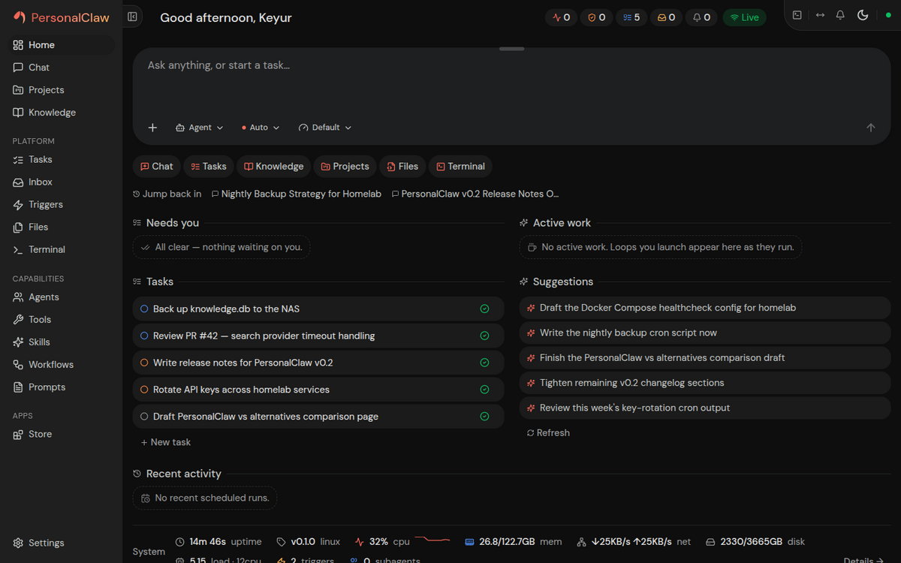
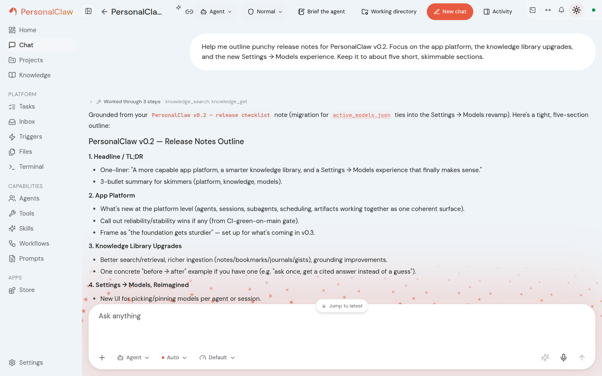
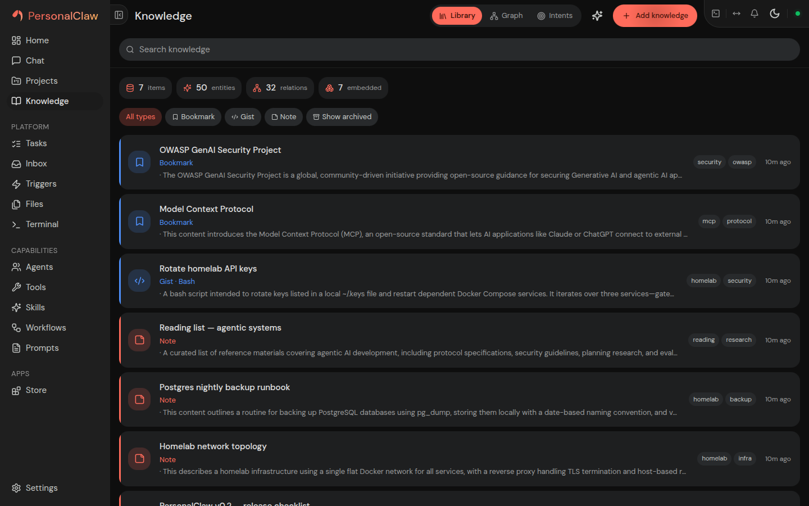
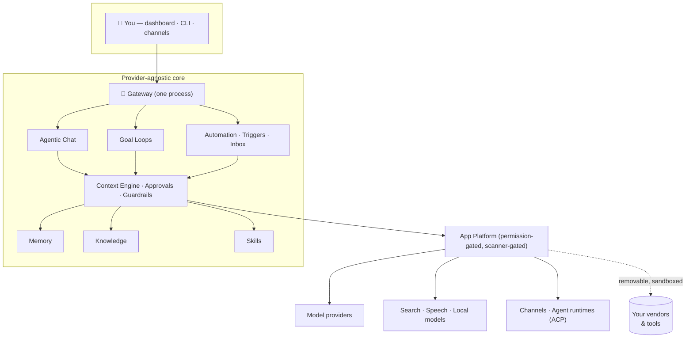

<div align="center">


# PersonalClaw

**Your self-hosted personal AI agent — an agentic operating system for one person.**

Chat, autonomous goal loops, long-term memory, a knowledge base, skills, scheduled
automation, and channel integrations — all behind one gateway process and one web
dashboard you own. Local-first, provider-agnostic, zero telemetry, MIT.

[](https://github.com/PersonalClaw/PersonalClaw/actions/workflows/ci.yml)
[](LICENSE)
[](pyproject.toml)
[](#privacy)
[](#)
[](#-pre-10-heads-up)



<sub><em>The dashboard — tasks, active work, and context-aware suggestions at a glance. Dark theme shown; PersonalClaw ships light and dark.</em></sub>

<table>
<tr>
<td width="50%"></td>
<td width="50%"></td>
</tr>
</table>

<p><strong>📸 <a href="SHOWCASE.md">See the full visual showcase »</a></strong> — dashboard, chat, goal loops, knowledge, memory, tasks, skills, automation, agents, and settings, in light and dark.</p>

</div>

---

## <a name="-pre-10-heads-up"></a>⚠️ Pre-1.0 — breaking changes expected

PersonalClaw is at **v0.1.0** and moving fast toward a deeper architecture (see the
[roadmap](docs/roadmap/roadmap.md)). It follows a **clean-break** engineering doctrine:
when a design is replaced, the old path is removed in the same change rather than carried
along behind compatibility shims. The upshot for you as an early user:

- **The next few minor (0.x) releases may introduce breaking changes with no automatic
  migration of your existing data** — sessions, memory, knowledge, config, and app state
  under `~/.personalclaw` may need to be recreated after an update.
- **Back up before every update.** Run `personalclaw snapshot` to create a portable state
  archive first (restore with `personalclaw restore`), and keep the archive somewhere safe.
- **Don't make this your only system of record yet.** Treat anything you put in
  PersonalClaw as reproducible or backed up elsewhere until backward compatibility becomes
  the default posture — which is exactly what the post-1.0
  [lifecycle doctrine](docs/roadmap/plans/LIFECYCLE-DOCTRINE.md) introduces (gated,
  migration-backed changes). Until then, run it as a power-user's second machine, not your
  primary driver.

This warning will be relaxed once migration-backed change discipline lands and 0.x
stabilizes. We'd rather tell you plainly now than surprise you on an update.

---

## What is PersonalClaw?

PersonalClaw runs AI agents that accomplish *your* work with a rich, user-assembled set
of capabilities. Every vendor — model providers, search, speech, channels, agent
runtimes — is a **removable app**, so nothing ties you to a single LLM vendor or service.
All state lives under one `~/.personalclaw` home on your machine; the system degrades
gracefully to local-only and never requires the network for core operation.



## Highlights

### 🗣️ Agentic chat
Multi-session chat with tool use and approval controls, session forking/undo, answer
variants, folders/tags/kanban, side conversations, per-session model overrides, and
temporary/incognito memory modes.

### 🎯 Goal loops
Give the agent a target and let it work autonomously — it classifies the goal, plans it,
then loops cycle by cycle under a **deterministic supervisor** you can pause, nudge, or stop.

### 🧠 Memory that learns
Layered semantic + episodic + procedural memory with active recall, after-turn learning
from your corrections, automatic promotion of repeated facts, and an optional
Obsidian-compatible markdown vault.

### 📚 Knowledge base
Ingest documents (PDF/DOCX/PPTX/HTML/…), web pages, and media; AI enrichment, entity
extraction, a knowledge graph, and semantic search wired into chat context.

### 🧩 Skills & 🔌 App platform
Reusable SKILL.md procedures with a marketplace and supply-chain scanning; a permission-gated
**Store** where model providers, search, speech, local models, channels, agent runtimes, and
full backend+UI apps install through a quarantine → scan → consent lifecycle.

### ⏰ Automation
Cron/interval/webhook triggers, background subagents, an inbox that watches channels and
drafts replies, and workflow SOPs surfaced automatically when they match.

### 🛡️ Security-first
Tool approval modes, a shell-command denylist, an egress guard with allow/deny host policy,
a tamper-evident (HMAC) security event log, app-scoped tokens, and honest labeling of the
one permission it can't technically enforce. See the [security model](docs/architecture/security.md).

## Quickstart

Install with one command — every path installs the **same release artifact** (no
per-channel special builds), and you don't need to install Python or Node yourself:

```bash
uv tool install personalclaw && personalclaw setup     # recommended — uv brings Python 3.12
```

Or use the bootstrap one-liner (installs `uv` if it's missing, then the above):

```bash
curl -fsSL https://personalclaw.dev/install | sh
```

Then start the gateway:

```bash
personalclaw gateway
```

### Install matrix

| Path | Command | Best for |
|---|---|---|
| **uv tool** *(recommended)* | `uv tool install personalclaw` | anyone — `uv` provides Python 3.12 |
| **Bootstrap** | `curl -fsSL https://personalclaw.dev/install \| sh` | the fastest start |
| pipx | `pipx install personalclaw` | isolated Python tools |
| pip | `pip install personalclaw` | inside an existing Python 3.12+ venv |
| **Docker Compose** | see below | self-hosters · Windows |
| Git checkout | [CONTRIBUTING](CONTRIBUTING.md#development-setup) | contributors / development |

### Docker Compose

```bash
cp .env.example .env && docker compose -f deploy/compose/compose.yaml up -d
```

Brings up the gateway + a TLS web proxy with a persistent volume — details, backups,
and updates in the [container guide](docs/guides/containers.md).

The dashboard opens at `http://localhost:10000`. Install a model-provider app from the
Store, add your API key under **Settings → Providers**, and bind a chat model under
**Settings → Models** — full walkthrough in [Getting started](docs/guides/getting-started.md).

> **Tech stack:** Python 3.12 · aiohttp gateway · React + Vite SPA · SQLite · MIT.
> **Platforms:** local process · Docker Compose · systemd/launchd service · desktop shell.

## <a name="privacy"></a>Privacy

**Zero telemetry.** PersonalClaw sends no usage data anywhere. It's single-user and
self-hosted; your conversations, memory, and knowledge never leave your machine unless
*you* wire up a remote provider app. Exports exclude credentials by design.

## Supply chain

The release pipeline practices the install-time gating the product itself preaches:
builds run in CI from a committed lockfile (`uv.lock`, installed with `uv sync
--locked`); PyPI publishing uses **Trusted Publishing** (OIDC — no long-lived tokens
stored anywhere) behind a manual owner-approval gate; every release attaches a **syft
SBOM** and **build-provenance attestations** on the wheel and images; and Dependabot
watches the pip, npm, and GitHub-Actions ecosystems weekly. `pip-audit` and `npm audit`
run on every push to `main`.

## Documentation

- [Getting started](docs/guides/getting-started.md) — install → first chat.
- [Architecture overview](docs/architecture/overview.md) — the system map (with diagrams).
- [Configuration reference](docs/reference/configuration.md) · [CLI](docs/reference/cli.md) · [API](docs/reference/api-overview.md)
- [Roadmap](docs/roadmap/roadmap.md) — 52 plans across 6 pillars, with a shared execution protocol.
- [Visual showcase](SHOWCASE.md) — every screen, light and dark.

## Contributing

See [CONTRIBUTING.md](CONTRIBUTING.md) for the engineering doctrine (clean-break-within-class,
provider-agnostic core, validate-as-a-user) and dev setup. First-party apps live in the
[PersonalClawApps](https://github.com/PersonalClaw/PersonalClawApps) repo — the community front door.

## License

[MIT](LICENSE)
