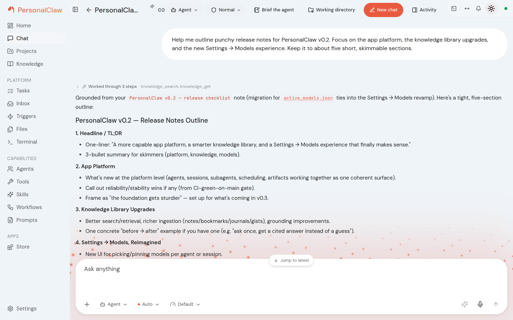
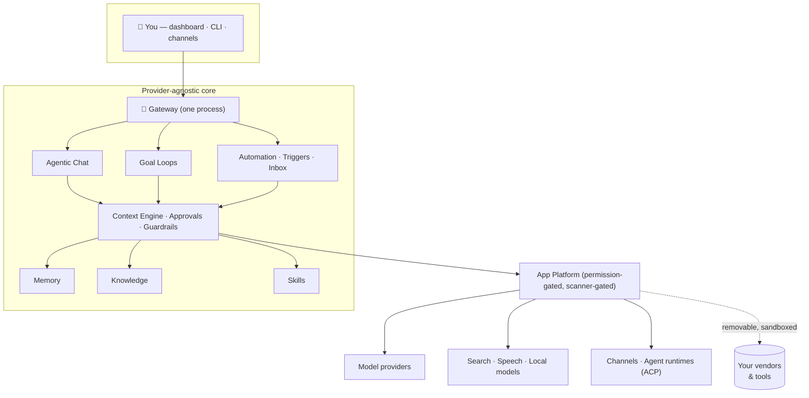

<div align="center">


# PersonalClaw

**Your self-hosted personal AI agent — an agentic operating system for one person.**

Chat, autonomous goal loops, long-term memory, a knowledge base, skills, scheduled
automation, and channel integrations — all behind one gateway process and one web
dashboard you own. Local-first, provider-agnostic, no analytics, MIT.

[](https://github.com/PersonalClaw/PersonalClaw/actions/workflows/full.yml?query=branch%3Amain)
[](https://github.com/PersonalClaw/PersonalClaw/actions/workflows/full.yml?query=branch%3Amain)
[](LICENSE)
[](pyproject.toml)
[](#privacy)
[](#what-is-personalclaw)
[](#-pre-10-heads-up)


<sub><em>The dashboard — tasks, active work, and context-aware suggestions at a glance. Dark theme shown; PersonalClaw ships light and dark.</em></sub>

<table>
<tr>
<td width="50%"></td>
<td width="50%"></td>
</tr>
</table>

<p><strong>📸 <a href="SHOWCASE.md">See the full visual showcase »</a></strong> — dashboard, chat, goal loops, knowledge, memory, tasks, skills, automation, agents, and settings, in light and dark.</p>

</div>

---

## <a name="-pre-10-heads-up"></a>⚠️ Pre-1.0 — breaking changes expected

PersonalClaw is at **v0.1.3** and moving fast toward a deeper architecture (see the
roadmap). It follows a **clean-break** engineering doctrine:
when a design is replaced, the old path is removed in the same change rather than carried
along behind compatibility shims. The upshot for you as an early user:

- **The next few minor (0.x) releases may introduce breaking changes with no automatic
  migration of your existing data** — sessions, memory, knowledge, config, and app state
  under `~/.personalclaw` may need to be recreated after an update.
- **Back up before every update.** Run `personalclaw snapshot` to create a portable state
  archive first (restore with `personalclaw restore`), and keep the archive somewhere safe.
- **Don't make this your only system of record yet.** Treat anything you put in
  PersonalClaw as reproducible or backed up elsewhere until backward compatibility becomes
  the default posture — the point at which gated, migration-backed changes replace
  clean breaks (the lifecycle mental model in
  [CONTRIBUTING.md](CONTRIBUTING.md#breaking-changes)). Until then, run it as a power-user's
  second machine, not your primary driver.
- **This is expected to last a while.** Migration-backed change discipline is scheduled
  deliberately *late* — it lands once the architecture has stopped moving, near the end of
  the current roadmap, because freezing compatibility around a
  half-built architecture is worse than breaking it honestly now. Plan for breaking 0.x
  updates as the norm, not the exception, for the foreseeable future.

This warning is relaxed only when that discipline lands — not on a date. We'd rather tell
you plainly now than surprise you on an update.

**Contributing?** None of this asks *you* to break compatibility: contributor changes stay
additive, and breaking changes are the maintainer's call. See
[CONTRIBUTING.md → Breaking changes](CONTRIBUTING.md#breaking-changes).

---

## What is PersonalClaw?

PersonalClaw runs AI agents that accomplish *your* work with a rich, user-assembled set
of capabilities. Every vendor — model providers, search, speech, channels, agent
runtimes — is a **removable app**, so nothing ties you to a single LLM vendor or service.
All state lives under one `~/.personalclaw` home on your machine; the system degrades
gracefully to local-only and never requires the network for core operation.


```mermaid
flowchart TB
    subgraph you[" "]
        U["👤 You — dashboard · CLI · channels"]
    end
    U --> GW["🦞 Gateway (one process)"]
    subgraph core["Provider-agnostic core"]
        GW --> CHAT["Agentic Chat"]
        GW --> LOOP["Goal Loops"]
        GW --> AUTO["Automation · Triggers · Inbox"]
        CHAT & LOOP & AUTO --> ENG["Context Engine · Approvals · Guardrails"]
        ENG --> MEM["Memory"]
        ENG --> KN["Knowledge"]
        ENG --> SK["Skills"]
    end
    ENG --> APPS["App Platform (permission-gated, scanner-gated)"]
    APPS --> P1["Model providers"]
    APPS --> P2["Search · Speech · Local models"]
    APPS --> P3["Channels · Agent runtimes (ACP)"]
    APPS -. "removable, sandboxed" .-> EXT[("Your vendors\n& tools")]
```

## Highlights

### 🗣️ Agentic chat
Multi-session chat with tool use and approval controls, session forking/undo, answer
variants, folders/tags/kanban, side conversations, per-session model overrides, and
temporary/incognito memory modes.

### 🎯 Goal loops
Give the agent a target and let it work autonomously — it classifies the goal, plans it,
then loops cycle by cycle under a **deterministic supervisor** you can pause, nudge, or stop.

### 🧠 Memory that learns
Layered semantic + episodic + procedural memory with active recall, after-turn learning
from your corrections, automatic promotion of repeated facts, and an optional
Obsidian-compatible markdown vault.

### 📚 Knowledge base
Ingest documents (PDF/DOCX/PPTX/HTML/…), web pages, and media; AI enrichment, entity
extraction, a knowledge graph, and semantic search wired into chat context.

### 🧩 Skills & 🔌 App platform
Reusable SKILL.md procedures with a marketplace and supply-chain scanning; a permission-gated
**Store** where model providers, search, speech, local models, channels, agent runtimes, and
full backend+UI apps install through a quarantine → scan → consent lifecycle.

### ⏰ Automation
Cron/interval/webhook triggers, background subagents, an inbox that watches channels and
drafts replies, and workflow SOPs surfaced automatically when they match.
Built to be left alone: **a run that fails reaches your inbox even when the automation is set to
deliver nothing**, a run that was gated is labelled inert rather than green, and a run whose process
died is terminalized instead of reading as running forever — with a recipe that
[falsifies all three](docs/guides/automations.md).

### 🛡️ Security-first
Tool approval modes, a shell-command denylist, an egress guard with allow/deny host policy,
a tamper-evident (HMAC) security event log, app-scoped tokens, and honest labeling of the
one permission it can't technically enforce. Controls are enforced at the point of execution,
not merely requested in a prompt — the [threat model](docs/security/threat-model.md) maps each
to the OWASP Agentic Top-10 with code citations and states the limitations plainly. Found a
security issue? Report it privately via [our security policy](SECURITY.md). See also the
[security model](docs/architecture/security.md).

## Does it do…?

Scanning for one specific word? Here it is, with what actually ships behind it today. The
caveat is part of the answer — where a capability needs an app installed or a provider
bound, the row says so rather than letting you find out after installing.

| Looking for | What ships today | Details |
|---|---|---|
| **RAG · retrieval · vector search** | A knowledge base over your own documents: keyword search (SQLite FTS5) is always available, and on top of it semantic **vector** retrieval, entity extraction, and a knowledge graph feed chat context with citations. **Caveat:** the vector half needs an embedding-provider app bound — with none bound, embeddings are off and retrieval stays keyword-only. | [Knowledge & memory](docs/architecture/knowledge-memory.md) |
| **Ollama · local models** | Run chat against a local Ollama with no API key: setup probes `localhost:11434`, and an opt-in, time-bounded sweep can find one elsewhere on your own private network. Downloading and managing local models is a first-class provider axis. **Caveat:** you supply Ollama itself — core ships the detection and the binding, not the inference server. The `ollama-models` bundle that owns that binding is the one model provider packaged in the wheel: it is seeded into your home at first boot and, like every native app, locked against disable and uninstall. Every *other* model provider is an app you install from the Store. | [App platform](docs/architecture/app-platform.md) |
| **web search** | `web_search` and `web_fetch` tools, plus the research flows built on them, served by a search-**provider app** you bind. **Caveat:** no search provider ships bundled, so nothing is bound out of the box — this is a provider seam you fill, not a batteries-included search feature. | [App platform](docs/architecture/app-platform.md) |
| **MCP — both directions** | PersonalClaw **connects out to any MCP server** you configure in `~/.personalclaw/mcp.json` — stdio or remote SSE/HTTP — and calls its tools inside the native agent loop. It also works the other way: it **exposes** six read-only tools of its own to your editor's assistant. **Caveat:** the outbound client needs the optional `personalclaw[mcp]` extra; without it the server registry is simply empty. | [Use it from your editor](docs/guides/use-from-your-ide.md) · [API](docs/reference/api-routes.md) |
| **SSO · SAML · OIDC login** | **Not shipped, by design** — PersonalClaw is single-user and self-hosted, so there is no directory to federate with. The gateway's selectable auth is a local token, or none when bound to loopback only; `api_key` and `oauth2` exist as half-implementations that no configuration can select, and the runtime says so out loud. Reaching it from outside is a tunnel plus password and TOTP 2FA instead. | [Remote access](docs/guides/remote-access.md) · [Security model](docs/architecture/security.md) |
| **Document upload** | Resumable chunked **upload** of large files — size-policed before the first byte and content-scanned on assembly — routed to a chat attachment, knowledge ingest, or your workspace. Documents ingest as PDF/DOCX/PPTX/HTML, web pages, and media. **Caveat:** PDFs/DOCX/PPTX/HTML/web pages parse with no model needed, but media (image OCR/vision, audio/video transcription) is model-gated — with none bound, the file still ingests, extraction just gracefully skips. | [Getting started](docs/guides/getting-started.md) |

## When PersonalClaw is *not* the right tool (yet)

The table above is what ships. This is the other half — eleven situations where you should
close this tab today rather than find the limit after an evening of setup. **"Never"
means a design boundary we expect to still hold at 1.0**, not a backlog item:

| If you… | Today | Because |
|---|---|---|
| need your data to survive upgrades | **no** | pre-1.0 clean breaks, and there is no migration machinery |
| have no model your machine can reach | **no** | no model ships; a fully offline install needs your own Ollama |
| need accounts for more than one person | **never** | single-user by construction — *"no hub in core, ever"* |
| want a native phone app | **no** | the phone is the dashboard installed as a PWA, not a store app |
| need a native Windows install | **no** | WSL2 or Docker Desktop only; the native port was ruled no-go |
| want a signed, auto-updating desktop app | **no** | macOS-only, unsigned, built from a checkout, no update channel |
| want it to live in Telegram / Discord / email | **no** | core registers exactly one channel: the web dashboard |
| expect web search to work out of the box | **no** | no search provider ships bundled — it is a seam you fill |
| plan to install apps you do not trust | **no** | the platform *vets* what you install; it does not confine it after |
| want a spend cap that works out of the box | **no** | the three ceilings are real but default to *unlimited*, and today meter unattended runs only — not the chat window |
| want a hosted service | **never** | you run the process — there is no SaaS and none is planned |

**[Read the full version, with the code citations »](docs/guides/when-not-to-use-personalclaw.md)**
Each item there names the file or the recorded decision that makes it true, so you can
check it rather than take our word for it.

## Quickstart

Install with one command — every path installs the **same release artifact** (no
per-channel special builds), and you don't need to install Python or Node yourself:

```bash
uv tool install personalclaw && personalclaw setup     # recommended — uv brings Python 3.12
```

Or use the bootstrap one-liner (installs `uv` if it's missing, then the above):

```bash
curl -fsSL https://personalclaw.dev/install | sh
```

Rather check the bytes before executing them? The script's digest is committed in
this repo, so you can verify it from a second origin first — see
[Verify the one-liner](docs/guides/getting-started.md#verify-the-one-liner).

Then start the gateway:

```bash
personalclaw gateway
```

### Install matrix

| Path | Command | Best for |
|---|---|---|
| **uv tool** *(recommended)* | `uv tool install personalclaw` | anyone — `uv` provides Python 3.12 |
| **Bootstrap** | `curl -fsSL https://personalclaw.dev/install \| sh` | the fastest start |
| pipx | `pipx install personalclaw` | isolated Python tools |
| pip | `pip install personalclaw` | inside an existing Python 3.12 or 3.13 venv |
| Homebrew | `brew install personalclaw/tap/personalclaw` | macOS · `brew upgrade` tracks releases |
| Nix | `nix profile install github:PersonalClaw/PersonalClaw#personalclaw` | a fully pinned, reproducible closure |
| **Docker** | see below | one container, no checkout, no `.env` |
| **Docker Compose** | see below | self-hosters · Windows · TLS proxy |
| Git checkout | [CONTRIBUTING](CONTRIBUTING.md#development-setup) | contributors / development |

Two caveats worth reading before you pick one of the bottom two, because both trade
something away and the row above cannot say what:

- **Homebrew** lives in a separate tap, [`PersonalClaw/homebrew-tap`](https://github.com/PersonalClaw/homebrew-tap).
  Its formula resolves the Python dependency closure from PyPI during `brew install`, so that
  install needs network and is **not** reproducible — the same guarantee `pip install` gives.
  Vendoring checksummed `resource` stanzas instead is not merely expensive here, it does not
  work: the closure requires `pypdfium2`, whose source build is a prebuilt PDFium with no
  Homebrew formula to link against. The tap's README states the whole trade-off, and its CI
  runs the real `brew install` on a clean GitHub-hosted macOS runner every push.
- **Nix** is the opposite trade: `flake.nix` pins every dependency through `flake.lock`, so it
  is the most reproducible path here — but it packages the **published wheel**, not your
  checkout. `nix run .#personalclaw` from a clone runs the release named in
  `nix/personalclaw.nix`, not your working tree; for that, use the development install in
  [CONTRIBUTING](CONTRIBUTING.md#development-setup).

These are exercised on a genuinely clean machine rather than a dev box, and no single harness
covers them all, so here is which one covers what: `scripts/fresh_install_validate.sh` drives
**pip, Homebrew and Nix** in a throwaway container; the `install-smoke` job in
`.github/workflows/full.yml` drives the **bootstrap one-liner** on a bare `ubuntu:latest` with
neither curl nor CA roots preinstalled; `.github/workflows/docker-single-container.yml` builds
the image and drives the **Docker** one-liner all the way to a *rendered dashboard*, not just a
`200` from `/api/healthz`; and the per-release checklist in the
[release runbook](docs/maintainers/release-runbook.md#convenience-channel-smoke-homebrew--nix)
walks Homebrew and Nix by hand. **pipx has no leg of its own** — it installs the same wheel
every other Python path installs, which is what "the same release artifact" above buys.

### Docker

One container, nothing to check out and no `.env` — the gateway image bundles the
dashboard:

```bash
docker run -d --name personalclaw -p 127.0.0.1:10000:10000 -e PERSONALCLAW_BIND_HOST=0.0.0.0 -v personalclaw_home:/data ghcr.io/personalclaw/personalclaw-gateway:latest
```

Then print the dashboard URL (it carries a one-time token — the default auth mode):

```bash
docker exec personalclaw personalclaw token
```

State lives in the named volume `personalclaw_home`, so it survives
`docker rm`/`docker run`. `-p 127.0.0.1:…` keeps the port on the host's loopback;
`PERSONALCLAW_BIND_HOST=0.0.0.0` is what lets that published port reach the gateway
*inside* the container (its own default is loopback, which a container cannot publish).
Swap `:latest` for a release tag to pin one.

### Docker Compose

```bash
cp .env.example .env && docker compose -f deploy/compose/compose.yaml up -d
```

Brings up the gateway + a TLS web proxy with a persistent volume — details, backups,
and updates in the [container guide](docs/guides/containers.md).

The dashboard opens at `http://localhost:10000`. Install a model-provider app from the
Store, add your API key under **Settings → Providers**, and bind a chat model under
**Settings → Models** — full walkthrough in [Getting started](docs/guides/getting-started.md).

### Updating

`personalclaw update` advances the install you actually have — the wheel, the checkout's
release tag, or the container's image tag. It tracks **releases**, not `main`: a git clone
checks out the resolved tag rather than fast-forwarding a branch.

```bash
personalclaw snapshot                        # pre-1.0: no automatic data migration
personalclaw update                          # → the newest release on your channel
personalclaw config set updates.pin 0.2.0    # …or stay on exactly 0.2.0
personalclaw update --to 0.1.3               # roll back: pins that release and installs it
```

A pin must name a release that actually exists: one that names no published release is
refused rather than quietly upgrading you (`select_target`, `src/personalclaw/self_update.py`).

Everything is in **Settings → Updates** too: the **channel** (`stable` · `beta` ·
`nightly` for contributors), a **version pin**, **automatic applies**
(`updates.auto=staged`, opt-in, held while work is in flight), the **check cadence**, and
one-click **rollback**. The release check is the one outbound call this project makes and
it can be switched off — see [Privacy](#privacy). Per-platform details:
[Updating](docs/guides/getting-started.md#updating) ·
[containers](docs/guides/containers.md#updates) ·
[desktop](docs/guides/desktop.md#updating).

> **Tech stack:** Python 3.12–3.13 · aiohttp gateway · React + Vite SPA · SQLite · MIT.
> **Run modes:** local process · Docker Compose · systemd/launchd service. (A macOS-only
> Electron desktop shell exists but is experimental — not built, signed, or released by CI,
> and has no auto-update channel.)

**Platform support.** Every row names what proves it — `CI:<job>` is a workflow job,
`checklist:<section>` is a documented manual walkthrough, `community` is user-reported
and not verified by us. Details and the `[models]`-extra per-arch reality:
[Platforms](docs/guides/platforms.md).

| Platform | Support | Proof |
|---|---|---|
| Linux x86-64 | first-class | `CI:full/matrix (ubuntu-latest)` + release smoke |
| Linux arm64 | first-class | `CI:full/matrix (ubuntu-24.04-arm)` + release smoke |
| macOS Apple silicon | first-class | `CI:full/matrix (macos-14)` |
| macOS Intel | best-effort | `community` |
| Windows via WSL2 | supported | `checklist:Windows via WSL2` — [Platforms](docs/guides/platforms.md) |
| Windows via Docker Desktop | supported | `checklist:Windows via Docker Desktop` — [Platforms](docs/guides/platforms.md) |
| Windows native | not supported | — |

## <a name="privacy"></a>Privacy

**No analytics, no crash reporting, no usage tracking.** PersonalClaw collects nothing about
how you use it and sends no usage data anywhere. It's single-user and self-hosted; your
conversations, memory, and knowledge never leave your machine unless *you* wire up a remote
provider app. Exports exclude credentials by design.

**One outbound call you should know about.** PersonalClaw asks GitHub whether a newer release
exists, on a schedule — by default at most once every 12 hours (`updates.check_interval_hours`,
`config/loader.py`) — identifying itself with a `personalclaw-update-check` User-Agent. It sends
no usage data, but it is a network request, so GitHub sees your IP, as it would for any HTTP call.

**You can turn that check off.** Set `updates.check_enabled` to `false` in your config and
PersonalClaw makes **zero** outbound calls to GitHub: no scheduled release check and no egress
from the updater at all. While the check is on, `updates.check_interval_hours` (1–168) tunes how
often it runs. `updates.auto` is a separate, orthogonal control — it gates whether an available
update is *applied*, not whether the check happens: `off` (the default) only notifies, while
`staged` applies at the next safe point (held while a session or subagent is running, and only
ever the resolved release tag, never raw `main`).

## Supply chain

The release pipeline practices the install-time gating the product itself preaches:
builds run in CI from a committed lockfile (`uv.lock`, installed with `uv sync
--locked`); PyPI publishing uses **Trusted Publishing** (OIDC — no long-lived tokens
stored anywhere) behind a manual owner-approval gate; every release attaches **syft
SPDX-JSON SBOMs** for the wheel and both architectures of each image, plus
**build-provenance attestations** for the wheel and images; and Dependabot watches the
pip, npm, and GitHub-Actions ecosystems weekly. `pip-audit` and `npm audit` run on every
push to `main`.

## Documentation

- [Getting started](docs/guides/getting-started.md) — install → first chat.
- [When PersonalClaw is not the right tool (yet)](docs/guides/when-not-to-use-personalclaw.md) — eleven situations where you should walk away today, each with the file or recorded decision that makes it true, and which limits are permanent design boundaries rather than unfinished work.
- [Working inside a chat](docs/guides/chat-surface.md) — the nine things the chat surface does beyond a send button: rewind to any earlier message, branch a conversation two ways, have a plan approved before anything runs, let a queued message cut in, find and quote, follow-up suggestions, the streaming reveal, and putting part of your screen into the conversation.
- [Automations you can leave alone](docs/guides/automations.md) — the three guarantees about unattended runs (a failure reaches your inbox even when delivery is off; a gated run is labelled inert, not green; a run whose host died is terminalized), each with the surface it is checked on, plus a recipe that falsifies all three in one automation.
- [Remote access](docs/guides/remote-access.md) — reaching your dashboard from outside your home network (tunnel + password + 2FA), and what it does *not* protect you from.
- [Companion apps](docs/guides/companion-apps.md) — a phone or a second machine on your own network: pairing, the optional LAN discovery (off by default), and exactly what it announces.
- [Build a channel app](docs/guides/build-a-channel-app.md) — bringing a new chat app or mailbox to PersonalClaw: the transport/delivery obligations, trust and pairing, and the conformance kit.
- [The desktop app](docs/guides/desktop.md) — the native capabilities a browser tab cannot offer: global push-to-talk (what it captures, when, and how you can always tell), and why system audio is microphone-only.
- [Use it from your editor](docs/guides/use-from-your-ide.md) — exposing six read-only MCP tools to your editor's assistant: minting the surface token, the client config, why it is same-machine-only, and the kill switch.
- [Writing skills](docs/guides/skills.md) — turning a procedure you keep restating into a skill: when it is the right container, the four tiers and which two are install sources rather than search paths, and how trigger phrases and semantic surfacing decide what the model actually sees.
- [Architecture overview](docs/architecture/overview.md) — the system map (with diagrams).
- [Configuration reference](docs/reference/configuration.md) · [CLI](docs/reference/cli.md) · [API](docs/reference/api-overview.md) · [HTTP routes](docs/reference/api-routes.md)
- Roadmap — maintainer-owned and deliberately not in this repo; the written way in is the
  [contribution intake path](CONTRIBUTING.md#the-model). **The short uppercase codes these
  pages sometimes cite** — `PP-16`, `AAP-5`, `CHANNEL-EXPANSION` — are identifiers from that
  unpublished plan set, kept only where they record *why* a behaviour exists. Nothing asks
  you to resolve them and nothing depends on your doing so: each page cites the code that
  actually decides, and the code is the authority.
- [Visual showcase](SHOWCASE.md) — every screen, light and dark.

## Contributing

See [CONTRIBUTING.md](CONTRIBUTING.md) for the engineering doctrine (clean-break-within-class,
provider-agnostic core, validate-as-a-user) and dev setup. First-party apps live in the
[PersonalClawApps](https://github.com/PersonalClaw/PersonalClawApps) repo — the community front door.

Looking for somewhere to start? The
[good-first-issue](https://github.com/PersonalClaw/PersonalClaw/issues?q=is%3Aopen+label%3Agood-first-issue)
label marks well-scoped work that needs little context.

**Questions, ideas, showing off what you built:**
[Discussions](https://github.com/PersonalClaw/PersonalClaw/discussions) — Q&A for help,
Show and tell for what you've made, Ideas for feature thinking. Bugs go to
[Issues](https://github.com/PersonalClaw/PersonalClaw/issues) instead, so they can be tracked
and closed.

The roadmap is maintainer-owned, but not opaque: propose changes in
[Discussions → Ideas](https://github.com/PersonalClaw/PersonalClaw/discussions/categories/ideas)
rather than by PR'ing the owner's internal roadmap (not in this repo). See
[the intake path](CONTRIBUTING.md#the-model).

## License

[MIT](LICENSE) — and, as of **2026-09-18**, four commitments about keeping it that way:

- **MIT only.** PersonalClaw has been MIT since its first commit and has never been under any
  other licence. No dual licensing, no "open core" tier, no source-available or
  sustainable-use variant.
- **No CLA.** There is no contributor licence agreement and none is planned. Contributions
  come in under the [DCO sign-off](CONTRIBUTING.md) and stay MIT — nobody is asked to assign
  copyright, which means nobody here holds the paperwork it would take to relicense your work.
- **No telemetry.** No analytics, no crash reporting, no usage pings. See
  [Privacy](#privacy) for the single outbound call the product makes and how to switch it off.
- **No relicensing of already-published releases.** Every version already on PyPI, GHCR and
  the GitHub releases page is MIT permanently. A hypothetical future licence change could
  only ever apply to *new* releases; it could not reach back to the one you installed.

These are commitments, not a legal instrument — but they are **enforced against the tree**,
which is the part a promise usually lacks. `tests/test_licence_governance.py` reds CI on a
licence identifier that stops saying MIT anywhere in the repo, on a rewrite of `LICENSE`'s
grant text, and on a `CLA`/`CONTRIBUTOR_LICENSE_AGREEMENT` file appearing;
`tests/test_network_egress_hosts.py` reds it on a new outbound host. So changing any of the
four takes a deliberate, reviewable edit to committed artifacts — never a quiet one.

Why say this at all: several self-hosted AI projects have relicensed, added a CLA, reserved
stricter future terms, or been acquired without a licence commitment, and their users left
over it. PersonalClaw wins that comparison by having done none of it — which is invisible
unless it is written down.
